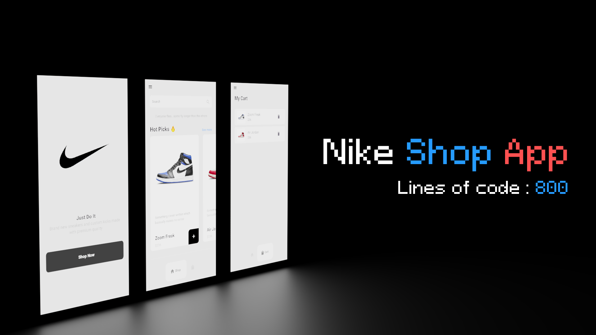

# Nike Shop App

My First flutter project directed towards learning basic ui designing and implementing basic functionalities

## Getting Started

This project is a starting point for a Flutter application.

A few resources to get you started if this is your first Flutter project:

- [Lab: Write your first Flutter app](https://docs.flutter.dev/get-started/codelab)
- [Cookbook: Useful Flutter samples](https://docs.flutter.dev/cookbook)

For help getting started with Flutter development, view the
[online documentation](https://docs.flutter.dev/), which offers tutorials,
samples, guidance on mobile development, and a full API reference.

https://github.com/SimplySaum/Nike-Shop/assets/173136832/54ca8ecb-e963-4e03-92fd-05bc8bc2d58c

